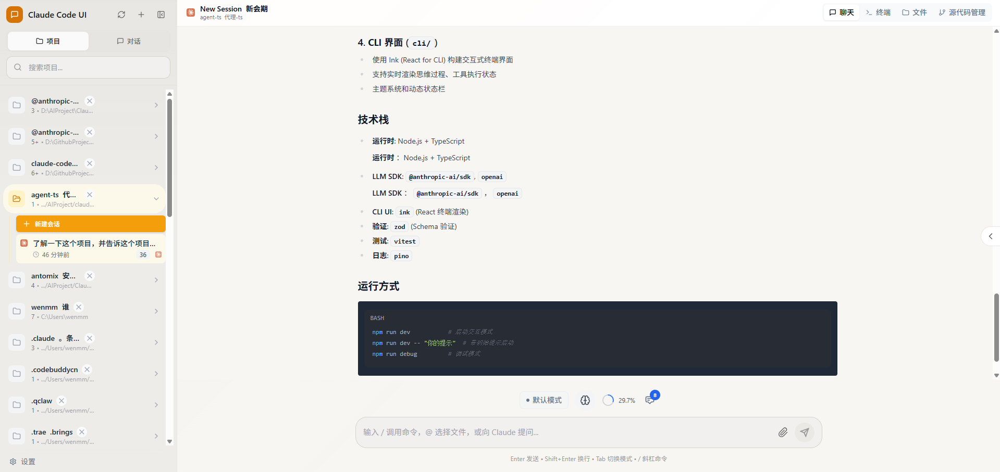
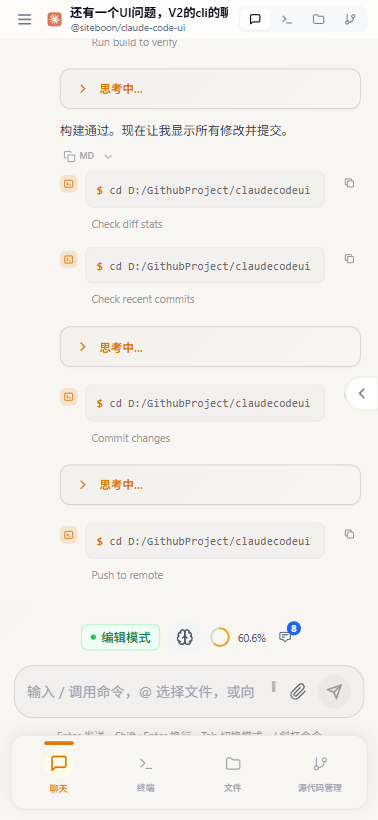
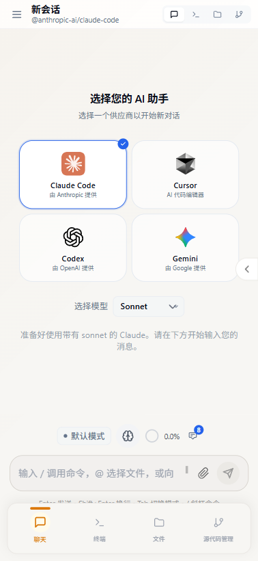
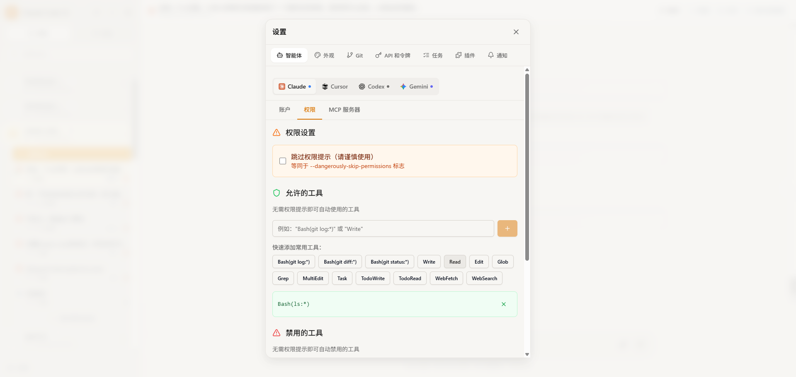

<div align="center">
  
  <h1>Cloud CLI（別名 Claude Code UI）</h1>
  <p><a href="https://docs.anthropic.com/en/docs/claude-code">Claude Code</a>、<a href="https://docs.cursor.com/en/cli/overview">Cursor CLI</a>、<a href="https://developers.openai.com/codex">Codex</a>、<a href="https://geminicli.com/">Gemini-CLI</a> のためのデスクトップ／モバイル UI。<br>ローカルでもリモートでも使え、アクティブなプロジェクトとセッションをどこからでも閲覧できます。</p>
</div>

<p align="center">
  <a href="https://cloudcli.ai">CloudCLI Cloud</a> · <a href="https://cloudcli.ai/docs">ドキュメント</a> · <a href="https://discord.gg/buxwujPNRE">Discord</a> · <a href="https://github.com/siteboon/claudecodeui/issues">バグ報告</a> · <a href="CONTRIBUTING.md">コントリビュート</a>
</p>

<p align="center">
  <a href="https://cloudcli.ai"></a>
  <a href="https://discord.gg/buxwujPNRE"></a>
  <br><br>
  <a href="https://trendshift.io/repositories/15586" target="_blank"></a>
</p>

<div align="right"><i><a href="./README.md">English</a> · <a href="./README.ru.md">Русский</a> · <a href="./README.de.md">Deutsch</a> · <a href="./README.ko.md">한국어</a> · <a href="./README.zh-CN.md">中文</a> · <b>日本語</b></i></div>

---

## スクリーンショット

<div align="center">

<table>
<tr>
<td align="center">
<h3>デスクトップビュー</h3>

<br>
<em>Claude Codeスタイルテーマのメインインターフェース</em>
</td>
<td align="center">
<h3>モバイル体験</h3>

<br>
<em>タッチナビゲーション付きレスポンシブモバイルデザイン</em>
</td>
</tr>
<tr>
<td align="center" colspan="2">
<h3>CLI選択</h3>

<br>
<em>Claude Code、Gemini、Cursor CLI、Codexから選択</em>
</td>
</tr>
</table>

</div>

## 機能

- **レスポンシブデザイン** - デスクトップ、タブレット、モバイルでシームレスに動作し、どこからでもAgentsを使用可能
- **Claude Codeスタイルテーマ** - Claude Code CLIの美学に着想を得た美しいアンバートーンのデザイン
- **インタラクティブチャットインターフェース** - Agentsとのスムーズなコミュニケーションのための内蔵チャットUI
- **統合シェルターミナル** - 内蔵シェル機能を通じてAgents CLIに直接アクセス
- **ファイルエクスプローラー** - シンタックスハイライトとライブ編集を備えたインタラクティブなファイルツリー
- **Gitエクスプローラー** - 変更の確認、ステージング、コミットが可能。ブランチの切り替えも対応
- **柔軟なワークスペース選択** - 制限なく任意のドライブやディレクトリからワークスペースを選択可能
- **セッション管理** - 会話の再開、複数セッションの管理、履歴の追跡
- **プラグインシステム** - カスタムプラグインでCloudCLIを拡張 — 新しいタブ、バックエンドサービス、統合を追加。 [自作する →](https://github.com/cloudcli-ai/cloudcli-plugin-starter)
- **TaskMaster AI統合** *(オプション)* - AI搭載のタスク計画、PRD解析、ワークフロー自動化による高度なプロジェクト管理
- **モデル互換性** - Claude、GPT、Geminiモデルファミリーに対応（対応モデルの全リストは [`shared/modelConstants.js`](shared/modelConstants.js) を参照）

## クイックスタート

### CloudCLI Cloud（推奨）

ローカルセットアップ不要で最も早く始められる方法。Web、モバイルアプリ、API、またはお気に入りのIDEからアクセス可能な完全管理型コンテナ化開発環境。

**[CloudCLI Cloudを始める](https://cloudcli.ai)**

### セルフホスト（オープンソース）

**npx**で即座にCloudCLI UIを起動（Node.js v22+が必要）:

```
npx @siteboon/claude-code-ui
```

または定期使用のために**グローバルインストール**:

```
npm install -g @siteboon/claude-code-ui
cloudcli
```

`http://localhost:3001` を開く — 既存のすべてのセッションが自動的に検出されます。

より多くの設定オプション、PM2、リモートサーバーセットアップなどは **[ドキュメント →](https://cloudcli.ai/docs)** を参照

---

## どのオプションが適していますか？

CloudCLI UIはCloudCLI Cloudを動かすオープンソースのUIレイヤーです。自分のマシンでセルフホストするか、完全管理型クラウド環境、チーム機能、より深い統合を提供するCloudCLI Cloudを使用できます。

| | CloudCLI UI (セルフホスト) | CloudCLI Cloud |
|---|---|---|
| **適した対象** | 自分のマシンでローカルエージェントセッションのための完全なUIを求める開発者 | クラウドで実行されるエージェントにどこからでもアクセスしたいチームや開発者 |
| **アクセス方法** | `[yourip]:port` でブラウザからアクセス | ブラウザ、任意のIDE、REST API、n8n |
| **セットアップ** | `npx @siteboon/claude-code-ui` | セットアップ不要 |
| **マシンを付けっぱなしにする必要** | はい | いいえ |
| **モバイルアクセス** | ネットワーク上の任意のブラウザ | 任意のデバイス、ネイティブアプリ開発中 |
| **利用可能なセッション** | `~/.claude` からすべてのセッションを自動検出 | クラウド環境内のすべてのセッション |
| **サポートするAgents** | Claude Code、Cursor CLI、Codex、Gemini CLI | Claude Code、Cursor CLI、Codex、Gemini CLI |
| **ファイルエクスプローラーとGit** | UIに内蔵 | UIに内蔵 |
| **MCP設定** | UIで管理、ローカルの `~/.claude` 設定と同期 | UIで管理 |
| **IDEアクセス** | ローカルIDE | クラウド環境に接続された任意のIDE |
| **REST API** | はい | はい |
| **n8nノード** | いいえ | はい |
| **チーム共有** | いいえ | はい |
| **プラットフォーム費用** | 無料、オープンソース | $7/月から |

> どちらのオプションも自分のAIサブスクリプション（Claude、Cursorなど）を使用します — CloudCLIは環境を提供し、AIではありません。

---

## セキュリティとツール設定

**🔒 重要なお知らせ**: すべてのClaude Codeツールはデフォルトで**無効**になっています。これにより、潜在的に有害な操作が自動的に実行されるのを防ぎます。

### ツールの有効化

Claude Codeの全機能を使用するには、ツールを手動で有効にする必要があります:

1. **ツール設定を開く** - サイドバーの歯車アイコンをクリック
2. **選択的に有効化** - 必要なツールのみオンにする
3. **設定を適用** - 設定はローカルに保存されます

<div align="center">


*ツール設定インターフェース - 必要なものだけ有効化*

</div>

**推奨アプローチ**: 基本的なツールから有効化し、必要に応じて追加してください。いつでも調整可能です。

---

## プラグイン

CloudCLIにはカスタムフロントエンドUIとオプションのNode.jsバックエンドを持つタブを追加できるプラグインシステムがあります。**Settings > Plugins**でgitリポジトリから直接プラグインをインストールするか、自分で作成してください。

### 利用可能なプラグイン

| プラグイン | 説明 |
|---|---|
| **[Project Stats](https://github.com/cloudcli-ai/cloudcli-plugin-starter)** | 現在のプロジェクトのファイル数、コード行数、ファイルタイプ分布、最大ファイル、最近変更されたファイルを表示 |
| **[Web Terminal](https://github.com/cloudcli-ai/cloudcli-plugin-terminal)** | マルチタブ対応の完全なxterm.jsターミナル |

### 自分で作成する

**[プラグインスターターテンプレート →](https://github.com/cloudcli-ai/cloudcli-plugin-starter)** — このリポジトリをフォークして独自のプラグインを作成。フロントエンドレンダリング、ライブコンテキスト更新、バックエンドサーバーとのRPC通信の例を含みます。

**[プラグインドキュメント →](https://cloudcli.ai/docs/plugin-overview)** — プラグインAPI、マニフェスト形式、セキュリティモデルなどの完全ガイド。

---
## FAQ

<details>
<summary>Claude Code Remote Controlとどう違いますか？</summary>

Claude Code Remote Controlを使用すると、ローカルターミナルですでに実行中のセッションにメッセージを送信できます。マシンを付けっぱなしにし、ターミナルを開いたままにする必要があり、ネットワーク接続がないと約10分でセッションがタイムアウトします。

CloudCLI UIとCloudCLI CloudはClaude Codeの横にあるのではなく、Claude Codeを拡張します — MCPサーバー、権限、設定、セッションはClaude Codeがネイティブに使用するものと全く同じです。何も複製されたり別々に管理されたりしません。

実践的にこれが意味すること:

- **すべてのセッション、1つだけではなく** — CloudCLI UIは `~/.claude` フォルダーからすべてのセッションを自動検出します。Remote ControlはClaudeモバイルアプリで利用可能にするために単一のアクティブセッションのみを公開します。
- **設定は設定** — CloudCLI UIで変更したMCPサーバー、ツール権限、プロジェクト設定はClaude Codeの設定に直接書き込まれ、即座に有効になり、その逆も同様です。
- **より多くのエージェントをサポート** — Claude Codeだけでなく、Cursor CLI、Codex、Gemini CLI。
- **完全なUI、チャットウィンドウだけではない** — ファイルエクスプローラー、Git統合、MCP管理、シェルターミナルがすべて内蔵されています。
- **CloudCLI Cloudはクラウドで実行** — ラップトップを閉じてもエージェントは実行し続けます。管理するターミナルも、付けっぱなしにするマシンもありません。

</details>

<details>
<summary>AIサブスクリプションを別途支払う必要がありますか？</summary>

はい。CloudCLIは環境を提供し、AIではありません。自分のClaude、Cursor、Codex、またはGeminiサブスクリプションを持ち込んでください。CloudCLI Cloudはその上に月$7からホスティング環境を提供します。

</details>

<details>
<summary>スマートフォンでCloudCLI UIを使用できますか？</summary>

はい。セルフホストの場合、マシンでサーバーを実行し、ネットワーク上の任意のブラウザで `[yourip]:port` を開きます。CloudCLI Cloudの場合、任意のデバイスから開けます — VPNなし、ポートフォワーディングなし、設定なし。ネイティブアプリも開発中です。

</details>

<details>
<summary>UIで行った変更はローカルのClaude Code設定に影響しますか？</summary>

はい、セルフホストの場合。CloudCLI UIはClaude Codeがネイティブに使用するのと同じ `~/.claude` 設定から読み取り、書き込みを行います。UIを通じて追加したMCPサーバーはClaude Codeに即座に表示され、その逆も同様です。

</details>

---

## コミュニティとサポート

- **[ドキュメント](https://cloudcli.ai/docs)** — インストール、設定、機能、トラブルシューティング
- **[Discord](https://discord.gg/buxwujPNRE)** — ヘルプを得て他のユーザーと交流
- **[GitHub Issues](https://github.com/siteboon/claudecodeui/issues)** — バグ報告と機能リクエスト
- **[コントリビュートガイド](CONTRIBUTING.md)** — プロジェクトに貢献する方法

## ライセンス

GNU Affero General Public License v3.0 or later (AGPL-3.0-or-later) — 全文は [LICENSE](LICENSE) を参照してください。

このプロジェクトはAGPL-3.0-or-laterライセンスの下で自由に使用、修正、配布できるオープンソースです。このソフトウェアを修正してネットワークサービスとして実行する場合、そのサービスのユーザーに修正したソースコードを提供する必要があります。

## 謝辞

### 使用技術
- **[Claude Code](https://docs.anthropic.com/en/docs/claude-code)** - Anthropic公式CLI
- **[Cursor CLI](https://docs.cursor.com/en/cli/overview)** - Cursor公式CLI
- **[Codex](https://developers.openai.com/codex)** - OpenAI Codex
- **[Gemini-CLI](https://geminicli.com/)** - Google Gemini CLI
- **[React](https://react.dev/)** - ユーザーインターフェースライブラリ
- **[Vite](https://vitejs.dev/)** - 高速ビルドツールと開発サーバー
- **[Tailwind CSS](https://tailwindcss.com/)** - ユーティリティファーストCSSフレームワーク
- **[CodeMirror](https://codemirror.net/)** - 高度なコードエディター
- **[TaskMaster AI](https://github.com/eyaltoledano/claude-task-master)** *(オプション)* - AI搭載のプロジェクト管理とタスク計画


### スポンサー
- [Siteboon - AI powered website builder](https://siteboon.ai)
---

<div align="center">
  <strong>Claude Code、Cursor、Codexコミュニティのために心を込めて制作。</strong>
</div>
